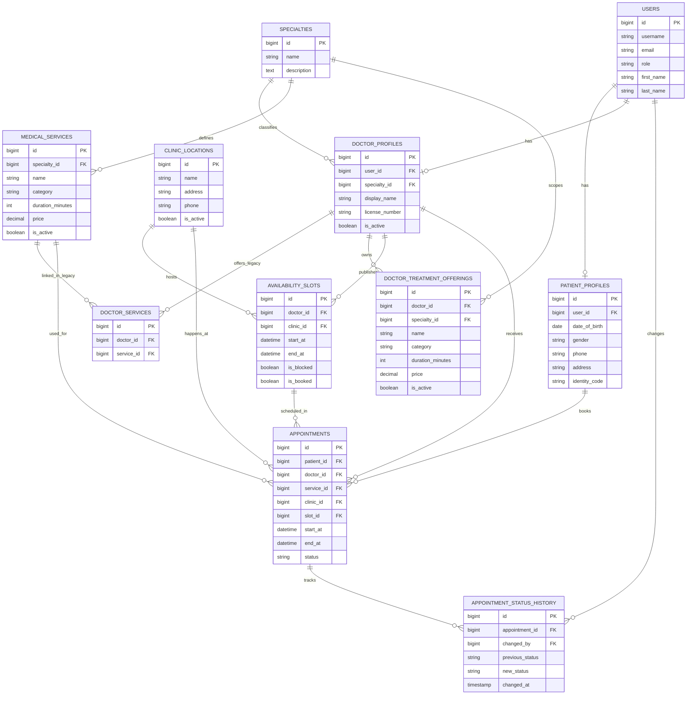

# ER Diagram

This diagram is based on the Laravel schema in `database/migrations`.

Notes:
- It covers the domain model and omits framework support tables such as `cache`, `cache_locks`, `sessions`, and `password_reset_tokens`.
- The branch currently contains both the legacy shared catalog path (`medical_services` + `doctor_services`) and the newer doctor-owned catalog path (`doctor_treatment_offerings`).
- Appointments still reference `medical_services`, not `doctor_treatment_offerings`.
- This Mermaid version is written for broad parser compatibility, so some uniqueness constraints are described here instead of encoded inline.
- Unique constraints in schema: `users.username`, `specialties.name`, `patient_profiles.user_id`, `doctor_profiles.user_id`, `doctor_services(doctor_id, service_id)`, `doctor_treatment_offerings(doctor_id, name)`, `availability_slots(doctor_id, start_at)`.

