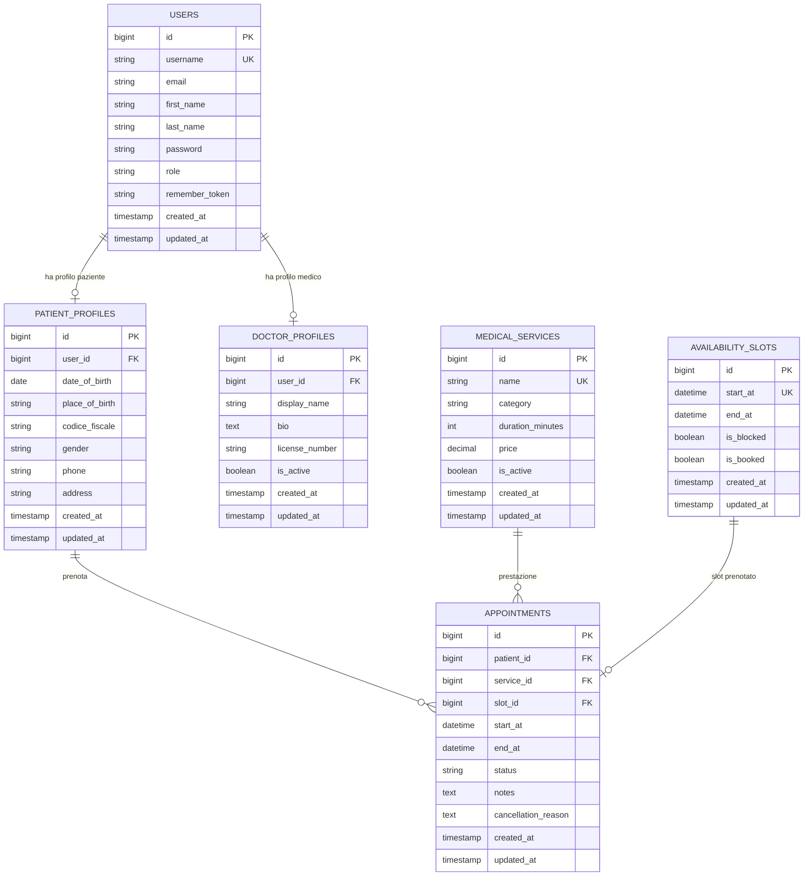

# ER Diagram

Schema aggiornato dopo la semplificazione a singolo medico. Il diagramma include solo le tabelle applicative attuali e omette le tabelle tecniche Laravel come `cache`, `sessions`, `password_reset_tokens` e `migrations`.

Note dominio attuale:

- L'applicazione e pensata per un solo medico, quindi `DOCTOR_PROFILES` resta per autenticazione/profilo dell'area medico ma non viene piu collegata a slot o appuntamenti.
- La specialita e fissa a livello applicativo, ad esempio dermatologia.
- Gli appuntamenti non salvano piu medico o ambulatorio, perche il sistema lavora con un solo medico e senza scelta ambulatorio.
- Le disponibilita sono globali del medico unico: `availability_slots.start_at` e univoco.
- I trattamenti dell'area medico coincidono con le prestazioni prenotabili e vengono salvati in `medical_services`.

Vincoli principali:

- `users.username` e univoco.
- `patient_profiles.user_id` e univoco.
- `doctor_profiles.user_id` e univoco.
- `medical_services.name` e univoco.
- `availability_slots.start_at` e univoco.
