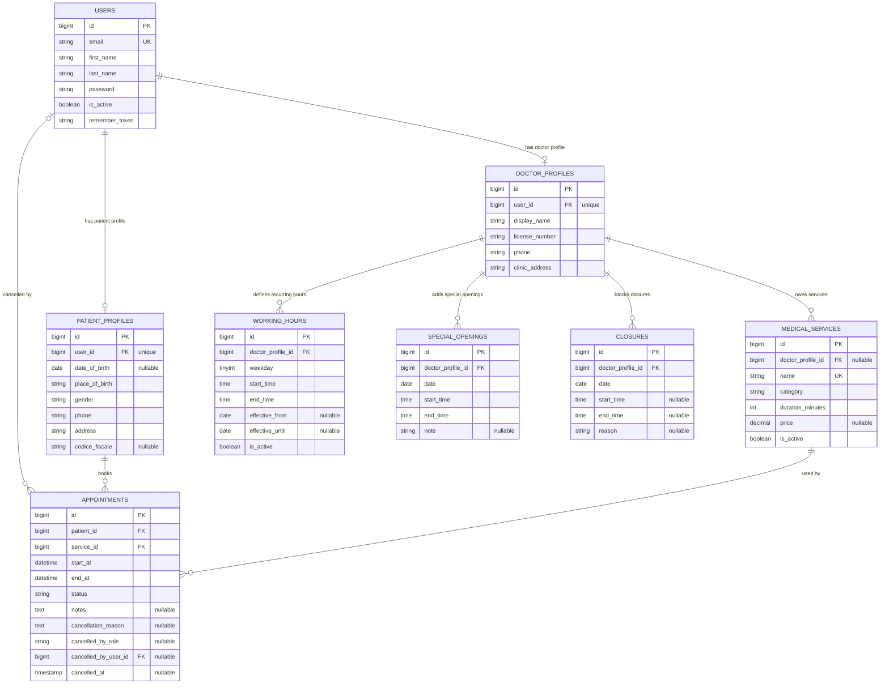

# ER Diagram

Schema aggiornato dopo lo spostamento dello stato attivo su `users`, della proprieta delle prestazioni su `medical_services` e dei ruoli utente fuori dalla colonna legacy `users.role`. Il diagramma usa i nomi reali delle tabelle applicative preesistenti e omette le tabelle tecniche Laravel come `cache`, `cache_locks`, `sessions`, `password_reset_tokens` e `migrations`, oltre alle tabelle del pacchetto Spatie (`roles`, `permissions`, `model_has_roles`, `model_has_permissions`, `role_has_permissions`).

> Nota: tutte le tabelle di dominio includono i timestamp standard `created_at` e `updated_at`, gestiti automaticamente da Eloquent. Sono omessi dal diagramma per leggibilita.

Note dominio attuale:

- Lo stato attivo dell'account e su `users.is_active`. `doctor_profiles` non contiene piu `bio` o `is_active`.
- `users.role` non esiste piu nello schema applicativo. I ruoli di accesso sono gestiti dalle tabelle Spatie, escluse da questo diagramma per mantenere il focus sulle tabelle applicative preesistenti.
- Le prestazioni appartengono a un medico tramite `medical_services.doctor_profile_id`. La colonna e nullable nello schema per compatibilita di migrazione, ma il flusso applicativo corrente valorizza sempre il medico proprietario quando crea o aggiorna una prestazione.
- Gli appuntamenti non salvano piu `doctor_profile_id`: il medico di una prenotazione si ricava dalla catena `appointments.service_id -> medical_services.doctor_profile_id`.
- Le regole di disponibilita restano collegate direttamente a `doctor_profiles` tramite `working_hours`, `special_openings` e `closures`.
- Non esistono piu `specialties`, `clinic_locations`, `doctor_services`, `doctor_treatment_offerings`, `availability_slots` o `appointment_status_history` nello schema corrente.
- Non esiste piu una tabella di slot fisici futuri. Gli orari prenotabili vengono generati dinamicamente a partire dalle regole di disponibilita e dagli appuntamenti attivi.
- La griglia di inizio appuntamento resta fissa a 30 minuti. La durata effettiva viene presa da `medical_services.duration_minutes` e deve entrare interamente in una finestra aperta.
- `closures` ha precedenza su aperture ordinarie e straordinarie. Se `start_time` e `end_time` sono nulle, la chiusura vale per l'intera giornata.
- Gli appuntamenti copiano `start_at` e `end_at` per conservare lo storico anche se le regole di disponibilita o la durata della prestazione cambiano in seguito.
- Le cancellazioni tracciano l'attore con `cancelled_by_role`, l'utente opzionale con `cancelled_by_user_id` e l'istante con `cancelled_at`.

Vincoli principali:

- `users.email` e univoco.
- `patient_profiles.user_id` e univoco.
- `doctor_profiles.user_id` e univoco.
- `medical_services.name` e univoco.
- `working_hours` indicizza `doctor_profile_id`, `weekday` e `is_active` per la generazione dinamica delle finestre.
- `special_openings` e `closures` indicizzano `doctor_profile_id` e `date`.
- Le prenotazioni non dipendono da uno slot persistito: la disponibilita viene riverificata in transazione bloccando il profilo medico della prestazione e controllando sovrapposizioni con appuntamenti attivi.
