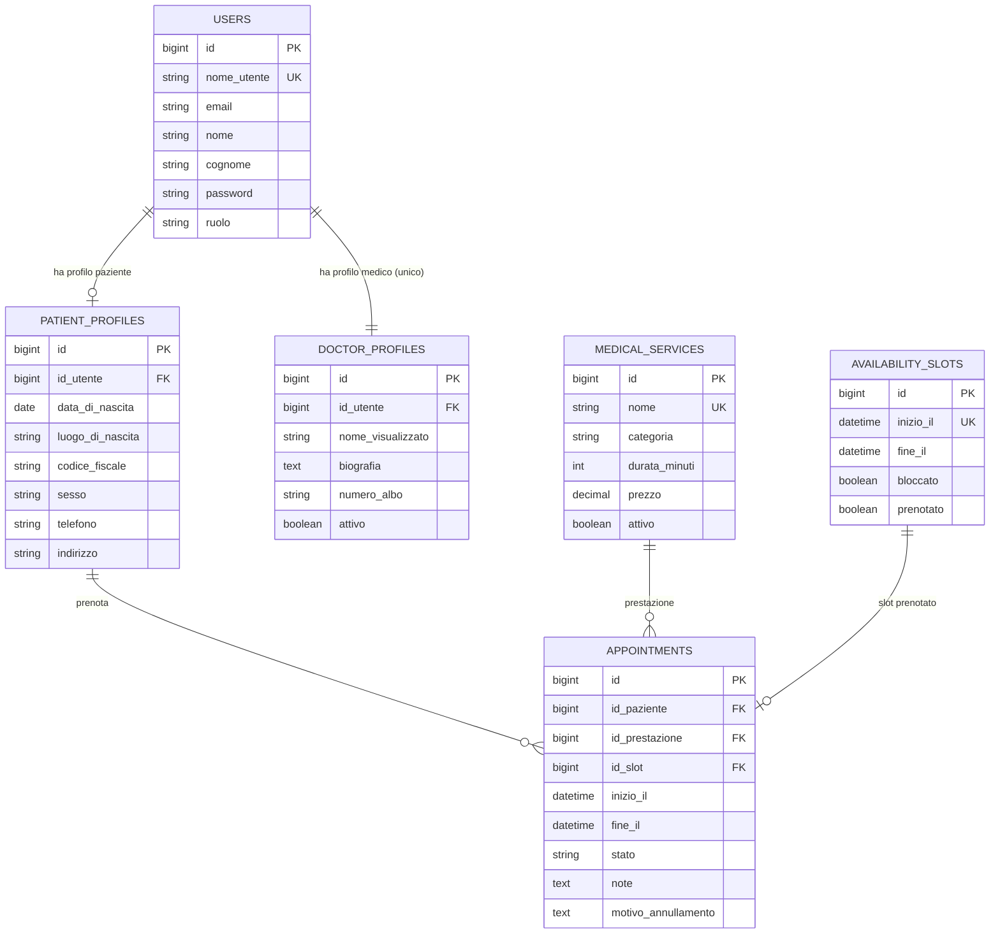

# ER Diagram

Schema aggiornato dopo la semplificazione a singolo medico. Il diagramma include solo le tabelle applicative attuali e omette le tabelle tecniche Laravel come `cache`, `sessions`, `password_reset_tokens` e `migrations`.

> Nota: tutte le tabelle includono i timestamp standard `creato_il` (`created_at`) e `aggiornato_il` (`updated_at`), gestiti automaticamente da Eloquent. Sono omessi dal diagramma per leggibilita.

Note dominio attuale:

- L'applicazione e pensata per un solo medico: la relazione `USERS — DOCTOR_PROFILES` e modellata come **1 a 1 obbligatoria** (esiste sempre uno e un solo utente con `role='doctor'`, creato via seeder, con il corrispondente record in `doctor_profiles`). `DOCTOR_PROFILES` resta per autenticazione/profilo dell'area medico ma non viene piu collegata a slot o appuntamenti.
- La specialita e fissa a livello applicativo, ad esempio dermatologia.
- Gli appuntamenti non salvano piu medico o ambulatorio, perche il sistema lavora con un solo medico e senza scelta ambulatorio.
- Le disponibilita sono globali del medico unico: `availability_slots.start_at` e univoco.
- I trattamenti dell'area medico coincidono con le prestazioni prenotabili e vengono salvati in `medical_services`.

Vincoli principali:

- `users.nome_utente` e univoco.
- `patient_profiles.id_utente` e univoco.
- `doctor_profiles.id_utente` e univoco.
- `medical_services.nome` e univoco.
- `availability_slots.inizio_il` e univoco.
