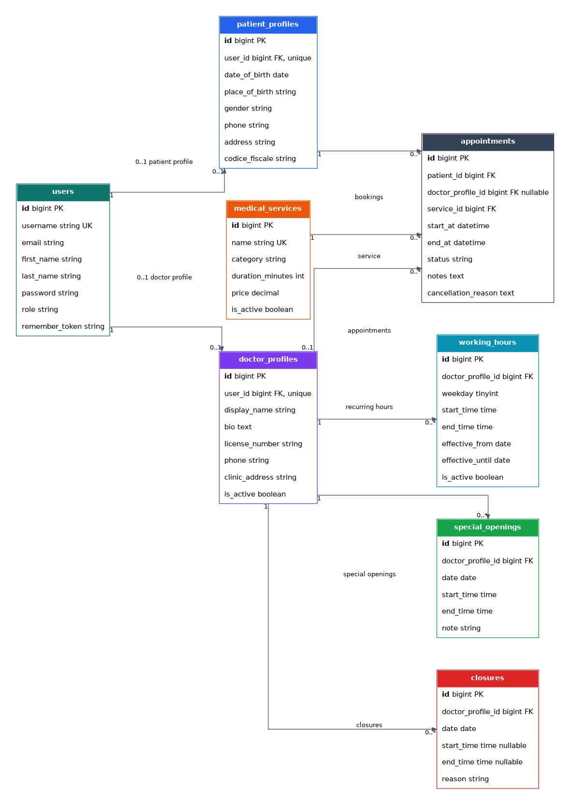
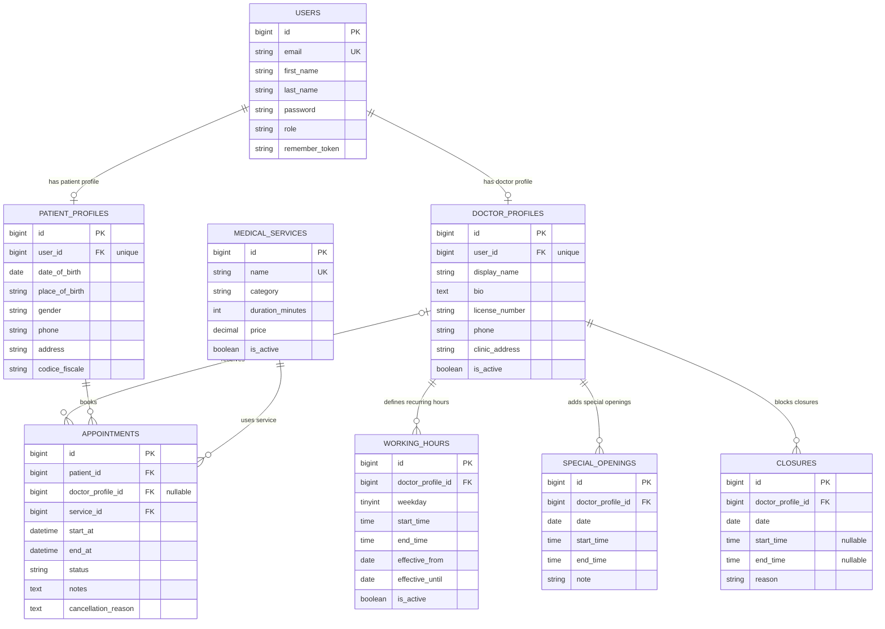

# ER Diagram

Schema aggiornato dopo il passaggio dalle disponibilita salvate come slot fisici alla disponibilita dinamica basata su regole. Il diagramma usa i nomi reali di tabelle e colonne presenti nel database e omette le tabelle tecniche Laravel come `cache`, `cache_locks`, `sessions`, `password_reset_tokens` e `migrations`.

> Nota: tutte le tabelle includono i timestamp standard `creato_il` (`created_at`) e `aggiornato_il` (`updated_at`), gestiti automaticamente da Eloquent. Sono omessi dal diagramma per leggibilita.

Note dominio attuale:

- L'applicazione resta pensata per un solo medico e un solo studio fisico. Le regole di disponibilita sono comunque collegate a `doctor_profiles` per mantenere chiara la proprieta del calendario.
- Il catalogo prestazioni e condiviso nel singolo studio: non esiste piu una tabella ponte tra medico e prestazioni.
- Non esiste piu una tabella di slot fisici futuri. Gli orari prenotabili vengono generati dinamicamente a partire da `working_hours`, `special_openings`, `closures` e dagli appuntamenti attivi.
- La griglia di inizio appuntamento resta fissa a 30 minuti. La durata effettiva viene presa da `medical_services.duration_minutes` e deve entrare interamente in una finestra aperta.
- `closures` ha precedenza su aperture ordinarie e straordinarie. Se `start_time` e `end_time` sono nulle, la chiusura vale per l'intera giornata.
- Gli appuntamenti copiano `start_at` e `end_at` per conservare lo storico anche se le regole di disponibilita cambiano in seguito.
- `appointments.doctor_profile_id` e nullable a livello database per compatibilita con la migrazione verso la disponibilita dinamica; il flusso applicativo corrente lo valorizza quando crea o aggiorna una prenotazione.

Vincoli principali:

- `users.email` e univoco.
- `patient_profiles.user_id` e univoco.
- `doctor_profiles.user_id` e univoco.
- `medical_services.name` e univoco.
- Le prenotazioni non dipendono da uno slot persistito: la disponibilita viene riverificata in transazione bloccando il profilo medico e controllando sovrapposizioni con appuntamenti attivi.
