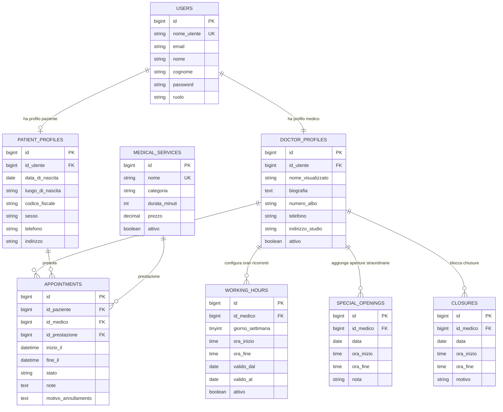

# ER Diagram

Schema aggiornato dopo il passaggio dalle disponibilita salvate come slot fisici alla disponibilita dinamica basata su regole. Il diagramma include solo le tabelle applicative attuali e omette le tabelle tecniche Laravel come `cache`, `sessions`, `password_reset_tokens` e `migrations`.

> Nota: tutte le tabelle includono i timestamp standard `creato_il` (`created_at`) e `aggiornato_il` (`updated_at`), gestiti automaticamente da Eloquent. Sono omessi dal diagramma per leggibilita.

Note dominio attuale:

- L'applicazione resta pensata per un solo medico e un solo studio fisico. Le regole di disponibilita sono comunque collegate a `doctor_profiles` per mantenere chiara la proprieta del calendario.
- Non esiste piu una tabella di slot fisici futuri. Gli orari prenotabili vengono generati dinamicamente a partire da `working_hours`, `special_openings`, `closures` e dagli appuntamenti attivi.
- La griglia di inizio appuntamento resta fissa a 30 minuti. La durata effettiva viene presa da `medical_services.durata_minuti` e deve entrare interamente in una finestra aperta.
- `closures` ha precedenza su aperture ordinarie e straordinarie. Se `ora_inizio` e `ora_fine` sono nulle, la chiusura vale per l'intera giornata.
- Gli appuntamenti copiano `inizio_il` e `fine_il` per conservare lo storico anche se le regole di disponibilita cambiano in seguito.

Vincoli principali:

- `users.nome_utente` e univoco.
- `patient_profiles.id_utente` e univoco.
- `doctor_profiles.id_utente` e univoco.
- `medical_services.nome` e univoco.
- Le prenotazioni non dipendono da uno slot persistito: la disponibilita viene riverificata in transazione bloccando il profilo medico e controllando sovrapposizioni con appuntamenti attivi.
